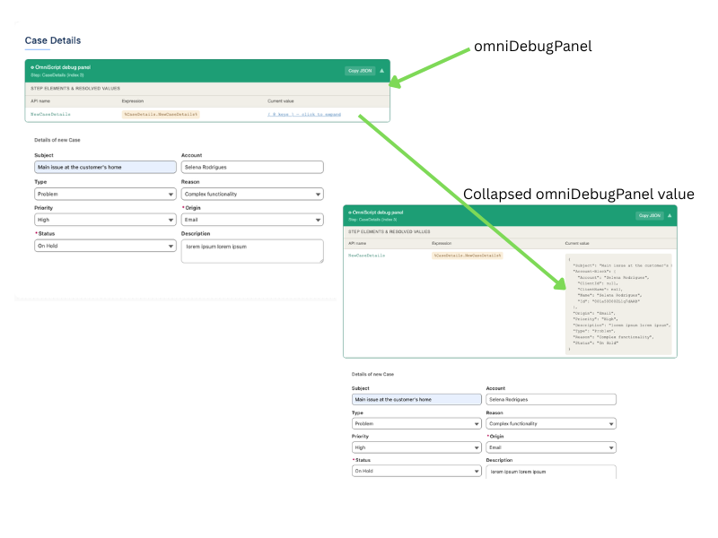

# OmniScript Debug Panel

A Lightning Web Component that gives you a real-time debug view of every element in your active OmniScript step — showing the field API name, its `%expression%` path, and the live resolved value from `omniJsonData`.

No more manually adding text blocks with `%JSON.Path%` references just to see what value a field is carrying. Drop this component into any step and get an instant, collapsible panel with everything laid out for you.

---

## The problem

When building or debugging an OmniScript, verifying the data flowing between steps, DataMappers, and Integration Procedures usually means:

1. Adding a new Block element to your step
2. Setting it to conditional view: `runMode=preview`
3. Manually adding a Text Block for every single field you want to inspect
4. Writing `FieldName: %Step:FieldName%` for each one

This is tedious, clutters your script, and has to be cleaned up before go-live.

---

## The solution

**OmniScript Debug Panel** reads `omniJsonData` and `omniScriptHeaderDef` directly from the OmniScript context and automatically renders a clean table of every field in the active step with its current value.



---

## Features

- Automatically detects the active step and its fields
- Shows the `%Step.FieldName%` expression for each field — ready to copy into a DataMapper or Integration Procedure
- Color-coded values: blue for strings, green for `true`, red for `false`
- Hides null and empty fields to reduce noise
- Collapsible panel — stays out of the way until you need it
- Copy JSON button — copies the full step data snapshot to your clipboard
- All inline styles — no CSS loading issues in any OmniStudio environment

---

## Installation

### Prerequisites

- Salesforce org with OmniStudio or Vlocity installed
- SFDX CLI (`sf` or `sfdx`)

### Steps

1. Clone this repository:
   ```bash
   git clone https://github.com/YOUR_USERNAME/omni-debug-panel.git
   cd omni-debug-panel
   ```

2. Deploy the component to your org:
   ```bash
   sf project deploy start -d force-app/main/default/lwc/omniDebugPanel
   ```

3. In **OmniScript Designer**, open any OmniScript and navigate to the step you want to debug.

4. Add a **Lightning Web Component** element to the step and set the component name to `omniDebugPanel`.

5. Save and activate the OmniScript, then run it. The debug panel will appear at the bottom of the step.

---

## OmniStudio package compatibility

The component imports `OmniscriptBaseMixin` — update the import path in `omniDebugPanel.js` to match your installed package:

| Package | Import path |
|---|---|
| OmniStudio (native / unlocked) | `omnistudio/omniscriptBaseMixin` |
| Vlocity Insurance | `vlocity_ins/omniscriptBaseMixin` |
| Vlocity CMT | `vlocity_cmt/omniscriptBaseMixin` |

```js
// Line 2 of omniDebugPanel.js — change the import to match your package
import { OmniscriptBaseMixin } from 'omnistudio/omniscriptBaseMixin';
```

---

## Usage

Once added to a step the panel renders collapsed. Click the green header bar to expand it.

| Column | Description |
|---|---|
| **API name** | The field's API name as defined in OmniScript Designer |
| **Expression** | The `%Step.FieldName%` path you can use in DataMappers, Set Values, and other elements |
| **Current value** | The live value from `omniJsonData` at the time the step renders |

The **Copy JSON** button copies the entire step's data object to your clipboard — useful for pasting into a DataMapper or Integration Procedure test harness.

> **Note:** Fields with null or empty values are hidden by default to keep the panel clean. If you need to see all fields regardless of value, remove the `.filter()` call in the `stepElements` getter in `omniDebugPanel.js`.

---

## Project structure

```
force-app/main/default/lwc/omniDebugPanel/
├── omniDebugPanel.html          # Component template
├── omniDebugPanel.js            # Controller — reads OmniScript context
├── omniDebugPanel.css           # Styles
└── omniDebugPanel.js-meta.xml   # Salesforce metadata config
```

---

## Contributing

Pull requests are welcome. For major changes please open an issue first to discuss what you would like to change.

---

## License

[MIT](LICENSE)
